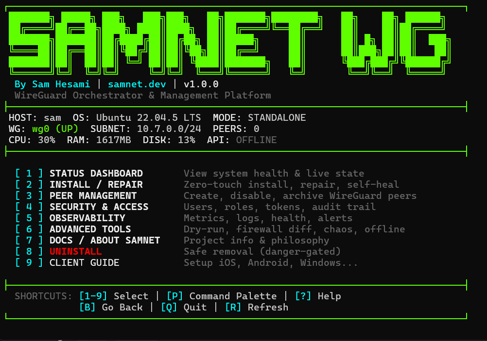
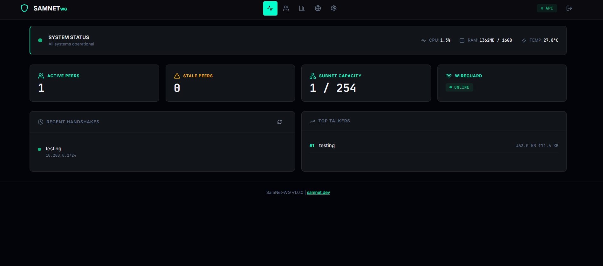

<div align="center">
<pre>
╔═══════════════════════════════════════════════════════════════════════════════════════╗
║                                                                                       ║
║  ███████╗ █████╗ ███╗   ███╗███╗   ██╗███████╗████████╗      ██╗    ██╗ ██████╗       ║
║  ██╔════╝██╔══██╗████╗ ████║████╗  ██║██╔════╝╚══██╔══╝      ██║    ██║██╔════╝       ║
║  ███████╗███████║██╔████╔██║██╔██╗ ██║█████╗     ██║   █████╗██║ █╗ ██║██║  ███╗      ║
║  ╚════██║██╔══██║██║╚██╔╝██║██║╚██╗██║██╔══╝     ██║   ╚════╝██║███╗██║██║   ██║      ║
║  ███████║██║  ██║██║ ╚═╝ ██║██║ ╚████║███████╗   ██║         ╚███╔███╔╝╚██████╔╝      ║
║  ╚══════╝╚═╝  ╚═╝╚═╝     ╚═╝╚═╝  ╚═══╝╚══════╝   ╚═╝          ╚══╝╚══╝  ╚═════╝       ║
║                                                                                       ║
║                      Z E R O - T O U C H   W I R E G U A R D                          ║
║                        V P N   O R C H E S T R A T O R                                ║
║                                                                                       ║
║                             [ v1.0.2 - samnet-wg ]                                    ║
║                                                                                       ║
╚═══════════════════════════════════════════════════════════════════════════════════════╝
</pre>
</div>

<div align="center">

[](https://github.com/SamNet-dev/wg-orchestrator)
[](LICENSE)
[]()
[]()

*One script. Full deployment. Complete control.*


</div>

---

## ❓ What is it?

**SamNet-WG** is a complete, enterprise-grade WireGuard VPN management solution that transforms any Linux server into a secure VPN appliance in under 5 minutes.

It features a unique **Dual-Control Plane** architecture:
1.  **High-Performance TUI**: A beautiful, flicker-free terminal interface for zero-latency management.
2.  **Modern Web Dashboard**: A synced, React-based web UI for remote administration.

Unlike standard scripts, SamNet-WG includes a **bi-directional sync engine**, ensuring that changes made in the terminal (CLI) are instantly reflected in the API/Web UI, and vice versa.

---

## 📸 Screenshots

<div align="center">

### 🖥️ Terminal User Interface (TUI)
*Full-featured terminal interface for zero-latency management*



---

### 🌐 Web User Interface
*Modern React-based dashboard for remote administration*



</div>

---

## ✨ Features

### 🛡️ Security First
- **Zero-Trust Architecture**: Strict IP validation and "Ghost Peer" prevention.
- **Audit Logging**: Immutable logs for all admin actions.
- **Scoped Uninstall**: Only `project=samnet-wg` labeled containers/images are removed.
- **Non-Root Services**: API and UI run as unprivileged users in Docker.

### 🎮 Interactive CLI (TUI)
- **Smart Refresh**: Flicker-free interface updates using `tput` and `SIGWINCH` handling.
- **System Transparency**: "About" screen explicitly lists all file paths.
- **Auto-Init**: Bandwidth tracking and databases initialize automatically.
- **Context Preservation**: Deep navigation menus that don't reset on refresh.

### 🔥 Firewall Management
- **Integrated Port Manager**: Manage open ports directly from the TUI (TCP/UDP support).
- **Smart Detection**: Automatically detects and whitelists existing services (Web, DB, Monitoring) during install.
- **Docker Compatible**: Runs safely alongside other containers without interfering with Docker networking.
- **Mode Awareness**: Detects existing firewalls (UFW/iptables) and adapts automatically.

### 🌐 Management
- **Sync Engine**: Edit files manually, use the CLI, or use the Web UI—it all stays in sync.
- **Bandwidth Limits**: Enforce data caps per peer (e.g., "10GB/month").
- **Visualizations**: ASCII graphs for bandwidth usage directly in the terminal.
- **QR Codes**: Instant mobile client onboarding.

---

## 🚀 Quick Start

### Quick Install

```bash
git clone https://github.com/SamNet-dev/wg-orchestrator.git
cd wg-orchestrator
sudo ./samnet.sh
```

The installer will guide you through setup (CLI-only or Web UI mode).

**Web UI Default Login:** `admin` / `changeme`

---

## 💻 Usage

### Terminal Interface

```bash
sudo samnet    # Launch main menu
```

```
┌──────────────────────────────────────────────────────────────────┐
│  MAIN MENU                                                       │
├──────────────────────────────────────────────────────────────────┤
│                                                                  │
│    [1]  Status Dashboard   System overview & health              │
│    [2]  Install / Repair   Zero-touch setup & self-healing       │
│    [3]  Peer Management    Create, list, limit, & edit peers     │
│    [4]  Security & Access  Audit logs, user roles                │
│    [5]  Observability      Live stats, graphs, & logs            │
│    [6]  Advanced Tools     Firewall diff, backup, dry-run        │
│    [7]  About / Docs       System paths & project info           │
│    [8]  Uninstall          Safe, scoped removal                  │
│                                                                  │
│    [Q]  Quit                                                     │
│                                                                  │
└──────────────────────────────────────────────────────────────────┘
```

### Common Operations

```bash
# Add a new peer
sudo samnet → Peers → Add Peer → Enter name → Scan QR

# Create temporary access (auto-expires)
sudo samnet → Peers → Add Peer → Temporary → Set days

# View live traffic
sudo samnet → Observability → Traffic Stats

# Uninstall securely
sudo samnet --uninstall
```

---

## 🏗️ Architecture

```
┌─────────────────────────────────────────────────────────────────────────┐
│                              SamNet-WG                                  │
├─────────────────────────────────────────────────────────────────────────┤
│                                                                         │
│  ┌──────────────┐    ┌──────────────┐    ┌──────────────┐             │
│  │   samnet.sh  │◄──►│   API (Go)   │◄──►│  UI (React)  │             │
│  │   CLI / TUI  │    │  Port 8766   │    │  Port 8080   │             │
│  └──────┬───────┘    └──────┬───────┘    └──────┬───────┘             │
│         │                   │                   │                     │
│         └─────────┬─────────┼───────────────────┘                     │
│                   │         │ (Sync Engine)                           │
│          ┌────────▼─────────▼────────┐                                │
│          │    State (SQLite + FS)    │                                │
│          │  /var/lib/samnet-wg/      │                                │
│          │  /opt/samnet/clients/     │                                │
│          └────────┬──────────────────┘                                │
│                   │                                                   │
│          ┌────────▼────────┐                                          │
│          │   WireGuard     │                                          │
│          │   Kernel Mod    │                                          │
│          └─────────────────┘                                          │
│                                                                       │
└─────────────────────────────────────────────────────────────────────────┘
```

---

## 📁 File Locations

We believe in full system transparency. Here is exactly where SamNet-WG stores its data:

| Path | Description |
|------|-------------|
| `/opt/samnet/` | Main installation directory (scripts, binaries). |
| `/opt/samnet/clients/` | Generated peer configuration files (`.conf`). |
| `/var/lib/samnet-wg/` | SQLite database and persistent application state. |
| `/var/log/samnet-wg/` | Application logs (rotated automatically). |
| `/etc/wireguard/` | WireGuard interface configuration (`wg0.conf`). |
| `/root/.samnet-wg_initial_credentials` | Initial admin credentials (delete after use). |

---

## 🔒 Security

- **Argon2id** password hashing.
- **CSRF tokens** on all state-changing API requests.
- **Strict Input Validation** preventing "Ghost Peers" (0.0.0.0 IPs).
- **Constant-time** auth comparisons.
- **Docker Pruning Scoped** to `project=samnet-wg` labels to avoid touching your other containers.

---

## 📋 Requirements

- **OS**: Debian 11+, Ubuntu 20.04+, Raspberry Pi OS
- **RAM**: 512 MB minimum
- **Disk**: 100 MB for CLI, 500 MB with Docker
- **Network**: Public IP or port forwarding (UDP 51820)

---

## 🤝 Contributing

Contributions welcome!

```bash
# Development setup
git clone https://github.com/SamNet-dev/wg-orchestrator.git
cd wg-orchestrator

# Test changes in debug mode
sudo ./samnet.sh --debug
```

---

## 📄 License

MIT License - See [LICENSE](LICENSE) for details.

---

<div align="center">

Built with ❤️ by [Sam](https://samnet.dev)

**[⬆ Back to Top](#samnet-wg)**

</div>
