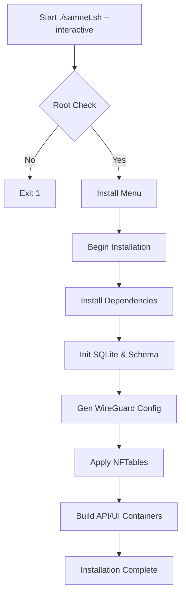

# CLI Screen Flow Diagrams

## Concept
High-performance TUI using Bash and `tput` for flicker-free rendering.
Navigation: Numbered menus. `0`, `B`, or `ESCAPE` for Back/Exit.

## 1. Main Menu (Authenticated)
```text
┌──────────────────────────────────────────────────────────────────┐
│  MAIN MENU                                                       │
├──────────────────────────────────────────────────────────────────┤
│                                                                  │
│    [1]  Status Dashboard   System overview & health              │
│    [2]  Install / Repair   Zero-touch setup & self-healing       │
│    [3]  Peer Management    Create, list, limit, & edit peers     │
│    [4]  Security & Access  Audit logs, user roles                │
│    [5]  Observability      Live stats, graphs, & logs            │
│    [6]  Advanced Tools     Firewall diff, backup, dry-run        │
│    [7]  About / Docs       System paths & project info           │
│    [8]  Uninstall          Safe, scoped removal                  │
│                                                                  │
│    [Q]  Quit                                                     │
│                                                                  │
└──────────────────────────────────────────────────────────────────┘
```

## 2. Interactive Install Wizard (Flow)


## 3. "Go Back" Navigation & Persistence
Every submenu includes a persistent loop, ensuring the screen doesn't exit on auto-refresh.

```text
┌──────────────────────────────────────────────────────────────────┐
│  PEER MANAGEMENT                                                 │
├──────────────────────────────────────────────────────────────────┤
│                                                                  │
│    Network Status                                                │
│    ────────────────────────────────────────────                  │
│    Subnet: 10.100.0.0/24    Peers: 12                            │
│                                                                  │
│    Peer Management                                               │
│                                                                  │
│    [1]  Add Permanent Peer                                       │
│    [2]  Add Temporary Peer                                       │
│    [3]  Add Bulk Peers                                           │
│    [4]  List Peers                                               │
│    [5]  View Usage                                               │
│    [6]  Set Data Limit                                           │
│    [7]  Remove Peer                                              │
│                                                                  │
│    [B]  Back                                                     │
│                                                                  │
└──────────────────────────────────────────────────────────────────┘
```

## 4. Error Handling
On input error:
- Screen does NOT clear immediately.
- Error message appears in Red below the prompt.
- User is prompted to retry.
